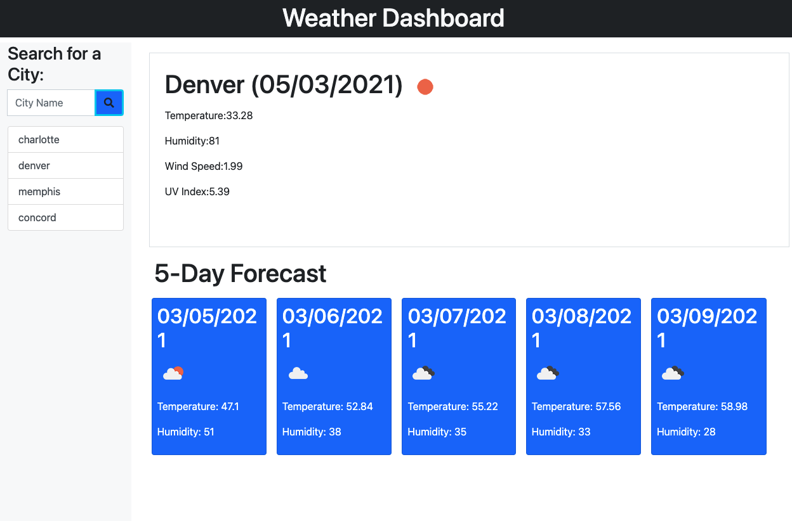

# weather-dashboard

## Desciption

This project allows a user to search for the weather of various US cities. It returns both the current date's conditions, as well as, the forcast for the coming five days.

## Requirements

GIVEN a weather dashboard with form inputs  
WHEN I search for a city  
THEN I am presented with current and future conditions for that city and that city is added to the search history  
WHEN I view current weather conditions for that city   
THEN I am presented with the city name, the date, an icon representation of weather conditions, the temperature, the humidity, the wind speed, and the UV index  
WHEN I view the UV index  
THEN I am presented with a color that indicates whether the conditions are favorable, moderate, or severe   
WHEN I view future weather conditions for that city   
THEN I am presented with a 5-day forecast that displays the date, an icon representation of weather conditions, the temperature, and the humidity  
WHEN I click on a city in the search history  
THEN I am again presented with current and future conditions for that city 

## Live Application

## Lessons Learned

This project provided continued development of my javascript skillset, as well as, bringing the additional challenges of working with api's. Working with and parsing through the data provided by https://openweathermap.org/ was very eye opening and an exciting challenge.

## Link to Deployed Application

https://ihm57511.github.io/weather-dashboard/
